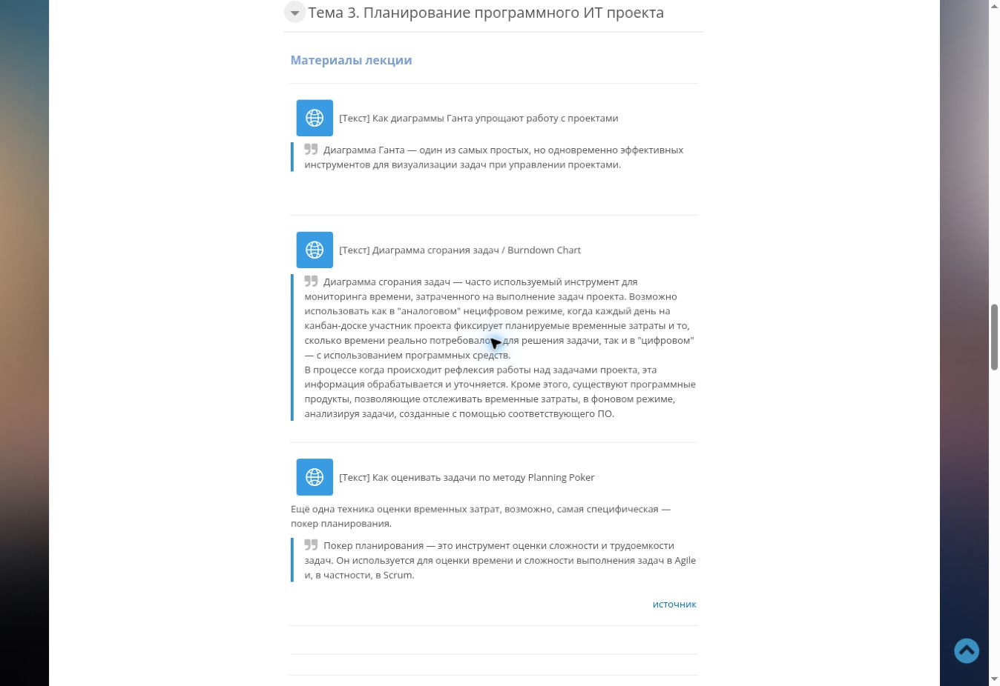
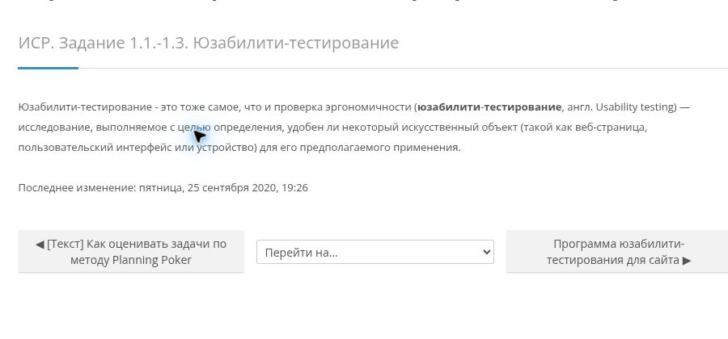
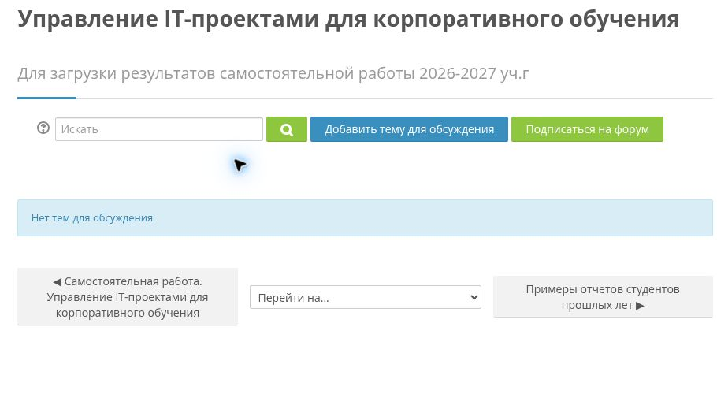
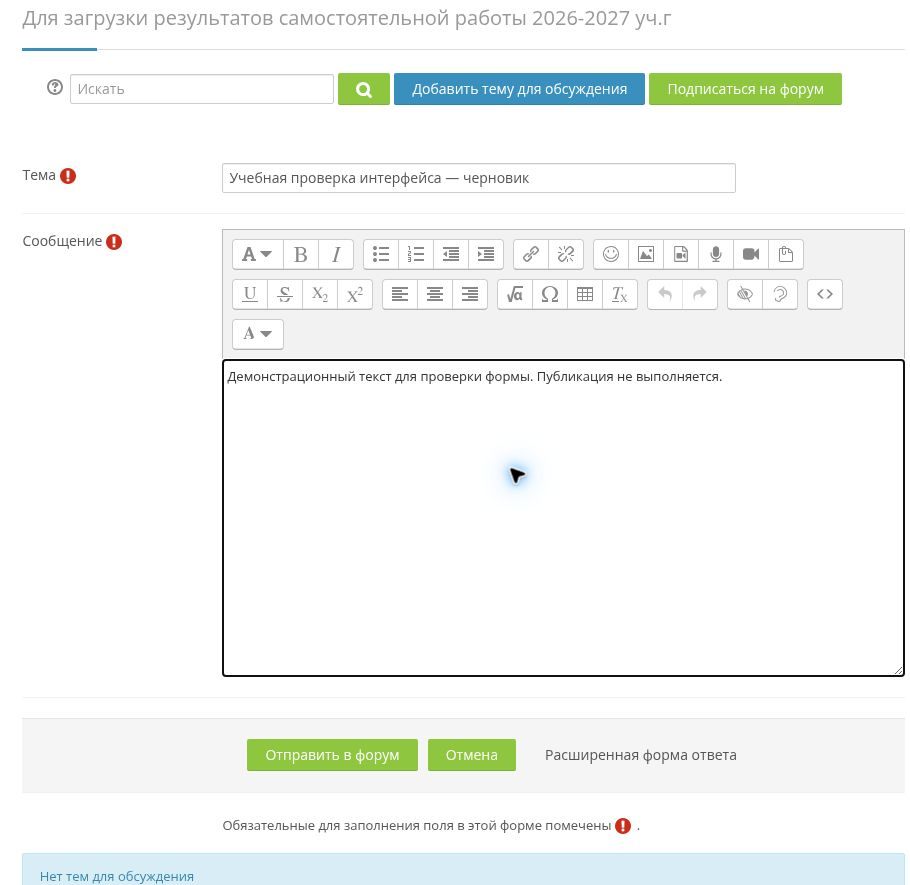
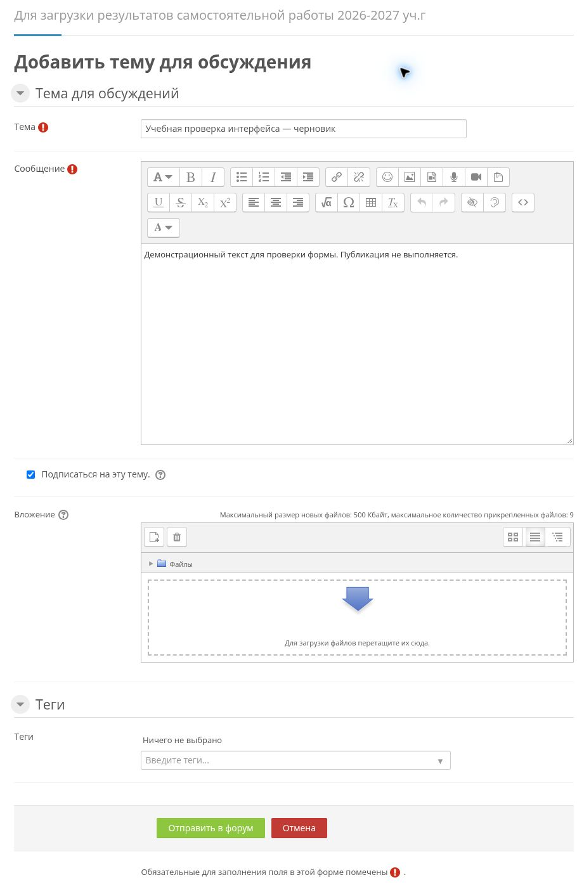

# Задание 1. Юзабилити-тестирование компонента образовательной среды

**Клементьев Алексей Александрович · 2ом_КЭО/25**  
«Управление IT-проектами для корпоративного обучения» · РГПУ им. А. И. Герцена  
Дата: **05.10.2026** · [К оглавлению](../README.md)

> **Учебная демонстрация.** Выполнено фактическое экспертное прохождение Moodle и подготовлена программа исследования для пилотного набора.

## 1. Цель и объект

Цель — выяснить, насколько понятен студенту путь от поиска задания и материалов до подготовки результата к сдаче.

Объект — модуль курса Moodle «Управление IT-проектами для корпоративного обучения»: разделы с заданиями, материалами и форумом для сдачи работ.

Проверяемый сценарий: **найти требования → найти материал SUS → открыть форум → подготовить тему → вернуться на страницу курса**.

Границы: настольный браузер Chrome, русская версия интерфейса, доступная студенту область курса. Процесс входа в Moodle в сценарий не входит.

## 2. Программа исследования

Использован подход из предоставленных материалов: задания в привычном контексте, метод «думать вслух», фиксация времени и ошибочных переходов.

### 2.1. Условные участники

Все профили соответствуют роли студента:

| Код | Профиль |
|---|---|
| P01 | Студент, впервые выполняющий работу в Moodle |
| P02 | Студент, использующий Moodle эпизодически |
| P03 | Студент, регулярно читающий материалы курса |
| P04 | Студент, имеющий опыт сдачи работ через форумы |
| P05 | Студент, помогающий одногруппникам пользоваться Moodle |

При реальном наборе следует обеспечить различный опыт Moodle и отсутствие участия в разработке курса. Пять сеансов достаточно для выявления критических проблем интерфейса.

### 2.2. Задания и критерии завершения

Начальная точка T1–T3 — верх страницы курса после входа. Для T4 модератор предоставляет открытую страницу нужного форума.

| Код | Инструкция участнику | Критерий успеха | Лимит |
|---|---|---|---:|
| T1 | «Найдите общие требования к оформлению результатов самостоятельной работы и скажите, где их сдавать». | Найден ресурс с требованиями в теме 1, указано назначение форума. | 180 с |
| T2 | «Найдите пример анкеты SUS и ссылку, где объясняется эта шкала». | Найден ресурс SUS в теме 3 и ссылка MeasuringU. | 180 с |
| T3 | «Найдите место для сдачи самостоятельной работы за 2026–2027 учебный год». | Открыт нужный форум в разделе «Результаты». | 180 с |
| T4 | «Подготовьте тему с названием и сообщением. Найдите, где можно прикрепить файл, и назовите ограничения». | Заполнены «Тема» и «Сообщение», ориентир на расширенную форму и максимум 500 Кбайт за файл. | 240 с |
| T5 | «Вернитесь на страницу курса из форума». | Открыта страница курса по навигационной ссылке. | 60 с |

В T1 проверяются общие инструкции курса. Поиск полного текста трёх текущих задач изучается в T2–T4.

### 2.3. Проведение сеанса

1. Объяснить цель: исследуется интерфейс, а не способности человека. Получить согласие на запись наблюдений и заполнение анкеты SUS.
2. Предложить выполнять действия привычным способом и вслух пояснять ожидания. Не показывать маршрут заранее.
3. Зачитать одно задание, включить таймер после окончания инструкции.
4. Зафиксировать время до критерия завершения или лимита, ошибочные переходы и необходимость помощи.
5. Если участник не продвигается 30 секунд и просит помощь, дать одну общую подсказку, не называя нужную кнопку.
6. При истечении лимита остановить попытку, восстановить начальную точку следующего задания. Для T4 отменить черновик.
7. После всех заданий предложить анкету SUS. Не обсуждать удобство до её заполнения.

Вопросы после задания: «Что вы ожидали увидеть?», «Что было непонятно?», «Где вы искали нужную функцию?». При необходимости — уто��няющие вопросы.

### 2.4. Метрики

| Метрика | Правило |
|---|---|
| Самостоятельное завершение | Число `success` / число всех попыток |
| Завершение с помощью | Число `assisted` / число всех попыток |
| Незавершение | Число `failed` / число всех попыток |
| Время попытки | Секунды от инструкции до успеха, помощи и успеха либо остановки |
| Ошибочные переходы | Число действий, не приближающих к цели |
| Субъективное удобство | SUS после всех заданий |

## 3. Фактическая проверка интерфейса

В живом Moodle были открыты материалы курса, страница задания и форум. Через «Добавить тему для обсуждения» подготовлена форма для сдачи.

### 3.1. Материалы и текст задания

В теме 3 ресурс юзабилити расположен после материалов о планировании проекта. Между верхом темы и заданием имеется несколько текстовых и видеоресурсов.



*Рисунок 1. Реальный участок темы 3: материалы о диаграммах и Planning Poker.*

При открытии «ИСР. Задание 1.1.-1.3. Юзабилити-тестирование» отображается определение юзабилити-тестирования и ссылка на вспомогательные материалы.



*Рисунок 2. Страница задания на момент проверки 05.10.2026.*

### 3.2. Форум и подготовка темы

Название форума говорит о загрузке результатов, а действие называется «Добавить тему для обсуждения». В пустом форуме доступна быстрая форма с полями «Тема» и «Сообщение».



*Рисунок 3. Форум после отмены черновика.*

Быстрая форма содержит обязательные поля «Тема» и «Сообщение» и редактор текста. Вложения доступны в расширенной форме.



*Рисунок 4. Демонстрационный текст заполнен при реальной проверке.*



*Рисунок 5. В расширенной форме доступны вложения: до 9 файлов по 500 Кбайт.*

### 3.3. Реестр наблюдений

Приоритеты являются экспертным суждением: P1 — устранить первым, P2 — улучшить после критичных.

| ID | Фактическое наблюдение | Возможное затруднение | Приоритет | Рекомендация |
|---|---|---|---|---|
| U01 | Страница задания содержит определение, без текста трёх задач; рис. 2. | Студент не может восстановить объём результата. | P1 | Поместить три задачи и критерии на страницу задания. |
| U02 | Форум для загрузки результатов предлагает «Добавить тему для обсуждения»; рис. 3. | Действие не очевидно как загрузка результата. | P1 | Добавить инструкцию о создании темы и представлении результата. |
| U03 | Вложения доступны в расширенной форме; в быстрой отдельного блока нет; рис. 4–5. | Студенту с готовым файлом требуется поиск интерфейса. | P2 | Указать на расширенную форму в инструкции форума. |
| U04 | Пустой форум показывает отсутствие тем, но не пример названия и сообщения; рис. 3–4. | Неясно, какие сведения включить в тему. | P2 | Показать пример сдачи в пустом состоянии форума. |
| U05 | Материалы разных типов идут длинным списком с описаниями; рис. 1. | Нужный ресурс требует прокрутки и внимательного чтения. | P2 | Добавить оглавление или разделить материалы по подтемам. |

Положительные свойства: понятные подписи полей, видимые отметки обязательности, текстовое пустое состояние форума.

## 4. Модельные результаты

Следующие таблицы — учебные данные для демонстрации обработки результатов.

### 4.1. Исходная таблица

В ячейках: **секунды / ошибочные переходы / статус**.  
**С** — самостоятельно; **П** — с одной подсказкой; **Н** — не завершено до лимита.

| Участник | T1 | T2 | T3 | T4 | T5 |
|---|---|---|---|---|---|
| P01 | 170 / 2 / П | 180 / 3 / Н | 180 / 2 / Н | 240 / 1 / Н | 20 / 0 / С |
| P02 | 130 / 1 / П | 60 / 0 / С | 125 / 2 / П | 240 / 2 / Н | 18 / 0 / С |
| P03 | 75 / 0 / С | 45 / 0 / С | 85 / 1 / С | 165 / 1 / С | 16 / 0 / С |
| P04 | 55 / 0 / С | 35 / 0 / С | 65 / 0 / С | 130 / 0 / С | 15 / 0 / С |
| P05 | 60 / 0 / С | 40 / 0 / С | 70 / 0 / С | 140 / 1 / С | 17 / 0 / С |

### 4.2. Сводка

| Зада��ие | Самостоятельно | С подсказкой | Не завершено | Среднее время попытки, с | Среднее самостоятельного времени, с | Ошибочные переходы |
|---|---:|---:|---:|---:|---:|---:|
| T1 | 3/5 | 2/5 | 0/5 | 98 | 63,3333 | 3 |
| T2 | 4/5 | 0/5 | 1/5 | 72 | 45 | 3 |
| T3 | 3/5 | 1/5 | 1/5 | 105 | 73,3333 | 5 |
| T4 | 3/5 | 0/5 | 2/5 | 183 | 145 | 5 |
| T5 | 5/5 | 0/5 | 0/5 | 17,2 | 17,2 | 0 |

Сводка 25 модельных попыток:

- **18/25 = 72%** завершены самостоятельно.
- **3/25 = 12%** завершены с подсказкой.
- **4/25 = 16%** не завершены.
- **21/25 = 84%** завершены с учётом помощи.
- Всего **16** ошибочных переходов.

T4 даёт наибольшее среднее время попытки — 183 с — и два незавершения. T2 и T3 дают по одному незавершению. T5 выполняется быстро всеми участниками.

### 4.3. Обработка

Исходные данные: [usability-model.json](../data/usability-model.json).  
Сводка: [usability-summary.json](../data/usability-summary.json).  
Скрипт: [summarize_usability.py](../scripts/summarize_usability.py).

```bash
python3 scripts/summarize_usability.py
```

Команда запускается из корня репозитория. Скрипт проверяет число попыток, уникальность пар «участник — задание» и рассчитывает метрики по разделу 2.4.

## 5. План улучшений и повторной проверки

| Порядок | Изменение | Как проверить после изменения |
|---|---|---|
| 1 | Обновить ресурс задания: три задачи и критерии отчётов | Новый участник объясняет состав результата, используя только страницу задания. |
| 2 | Добавить в форум инструкцию и пример сдачи | Участник правильно выбирает создание темы и заполняет название и текст. |
| 3 | Пояснить расширенную форму и ограничения вложений | Участник находит блок файлов и называет ограничение 500 Кбайт. |
| 4 | Сократить путь �� заданиям и SUS через оглавление | Повторить T1–T3 и сравнить самостоятельное завершение и время. |

Для следующего пилота внутренняя цель: не менее 4 из 5 участников выполняют каждое задание без подсказки.

## 6. Источники

1. [Курс Moodle](https://moodle.herzen.spb.ru/course/view.php?id=26648) — фактическая проверка 05.10.2026.
2. [Ресурс задания](https://moodle.herzen.spb.ru/mod/page/view.php?id=780596) — текст на рис. 2.
3. [Форум результатов](https://moodle.herzen.spb.ru/mod/forum/view.php?id=1353655) — быстрая и расширенная формы.
4. Предоставленные материалы «Юзабилити-тестирование V1.pdf» и изображение формы оценки.
5. [MeasuringU: System Usability Scale](https://measuringu.com/sus/) — метод оценки SUS.
6. [Протокол фактических наблюдений и перечень скриншотов](../evidence/README.md).

## 7. Выводы

Экспертное прохождение подтвердило доступность пути от курса к подготовке темы и выявило недостаток пояснений на критических этапах.

Программа исследования и учебный набор демонстрируют обработку результатов: 72% самостоятельных завершений, 84% с учётом помощи, 16 ошибочных переходов в 25 попытках. Улучшения по плану раздела 5 должны повысить долю самостоятельных завершений до целевых 80%.
