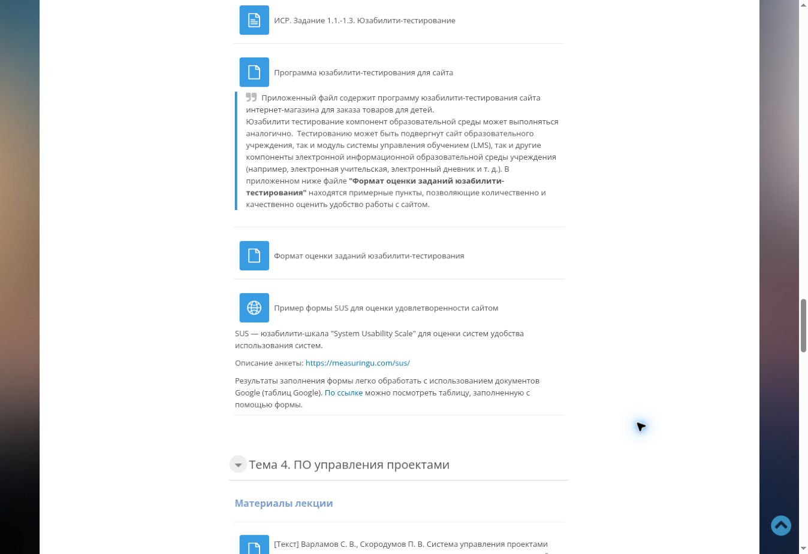

# Задание 2. Оценка удобства образовательного IT-продукта по SUS

**Клементьев Алексей Александрович · 2ом_КЭО/25**  
«Управление IT-проектами для корпоративного обучения» · РГПУ им. А. И. Герцена  
Дата: **05.10.2026** · [К оглавлению](../README.md)

> **Учебная демонстрация.** Анкета и вычисления подготовлены для модуля Moodle. Ответы P01–P05 вымышлены; реальный опрос студентов не проводился. Полученный балл не является измеренной оценкой Moodle.

## 1. Цель и объект оценки

Цель — продемонстрировать применение System Usability Scale (SUS) после выполнения образовательного сценария и интерпретацию результата.

Объект оценки — **работа в Moodle с поиском материалов курса и подготовкой темы в форуме сдачи самостоятельной работы**, а не Moodle целиком и не сам сайт Google Формы. Контекст задают T1–T5 из [первого отчёта](../01-usability/README.md): найти общие требования, найти SUS, открыть форум, подготовить тему и вернуться в курс.

SUS — короткая анкета из 10 утверждений с чередованием положительных и отрицательных формулировок. Она оценивает воспринимаемое удобство системы в целом. Для объяснения конкретных затруднений её следует рассматривать вместе с наблюдениями за выполнением заданий.

## 2. Исходные материалы

В теме 3 курса имеется ресурс «Пример формы SUS для оценки удовлетворенности сайтом» и ссылка на описание шкалы MeasuringU.



*Рисунок 1. Настоящий скриншот материалов Moodle, 05.10.2026. Проверено наличие ресурса и ссылок; ответы в исходную Google Форму не отправлялись.*

Предоставленные учебные примеры:

- [Описание SUS на MeasuringU](https://measuringu.com/sus/).
- [Пример Google Формы](https://docs.google.com/forms/d/e/1FAIpQLSemijZWH40WQ3pgKASx-cfustFqJJaYtZ0_5VuB8yIJqfgAJQ/viewform).
- [Пример Google Таблицы с обработкой](https://docs.google.com/spreadsheets/d/1JSjpGLWePOMNkh7KJrIEzmQ6p7nlHEaXAa57nGF3bBY/edit#gid=1229331132).

Последние две ссылки — исходные материалы задания. Их данные не использовались как результаты текущего исследования; доступность и состав ответов внешних примеров не проверялись в сеансе Moodle.

## 3. Анкета и порядок проведения

### 3.1. Инструкция

«Оцените только что выполненную работу в Moodle: поиск материалов курса и подготовку темы с результатами самостоятельной работы. Для каждого утверждения выберите один вариант. Здесь нет правильных ответов; важна ваша личная оценка».

| Ответ | Значение |
|---:|---|
| 1 | Совершенно не согласен |
| 2 | Скорее не согласен |
| 3 | Ни согласен, ни не согласен |
| 4 | Скорее согласен |
| 5 | Полностью согласен |

### 3.2. Утверждения

Ниже приведена рабочая русская адаптация стандартных утверждений для выбранного объекта. Сохранены порядок, смысл и полярность. Это не заявление о психометрической валидации отдельного перевода.

| № | Утверждение | Полярность |
|---|---|---|
| Q1 | Я думаю, что хотел(а) бы часто пользоваться этим модулем. | Положительное |
| Q2 | Я считаю этот модуль неоправданно сложным. | Отрицательное |
| Q3 | Я считаю, что этим модулем легко пользоваться. | Положительное |
| Q4 | Мне понадобится помощь технического специалиста, чтобы пользоваться этим модулем. | Отрицательное |
| Q5 | Я считаю, что функции этого модуля хорошо согласованы между собой. | Положительное |
| Q6 | Я считаю, что в этом модуле слишком много несогласованностей. | Отрицательное |
| Q7 | Я думаю, что большинство людей быстро научится пользоваться этим модулем. | Положительное |
| Q8 | Я считаю этот модуль громоздким и неудобным в использовании. | Отрицательное |
| Q9 | Я чувствовал(а) себя уверенно, пользуясь этим модулем. | Положительное |
| Q10 | Мне пришлось многое изучить, прежде чем начать пользоваться этим модулем. | Отрицательное |

### 3.3. Процедура

1. Предложить анкету сразу после T1–T5, до обсуждения выявленных проблем.
2. Использовать тот же анонимный код P01–P05; не собирать пароль или данные учётной записи.
3. Убедиться, что выбрано ровно одно значение для каждого из 10 утверждений.
4. Не объяснять, какой ответ «лучше», и не подсказывать при заполнении.
5. Считать индивидуальный балл, затем показатели группы.

При настоящем опросе незаполненную анкету нельзя молча дополнять средними значениями: следует попросить заполнить пропуск либо отдельно указать правило исключения. В демонстрационном наборе пропусков нет.

## 4. Модельные ответы

> Все 50 значений ниже созданы для учебного примера. Они не получены от людей.

Профили участников совпадают с первым отчётом: P01 — новичок, P02 — эпизодическое использование, P03 — регулярное использование, P04 — опыт сдачи через форум, P05 — помощь одногруппникам.

| Участник | Q1 | Q2 | Q3 | Q4 | Q5 | Q6 | Q7 | Q8 | Q9 | Q10 | SUS |
|---|---:|---:|---:|---:|---:|---:|---:|---:|---:|---:|---:|
| P01 | 2 | 4 | 3 | 4 | 2 | 4 | 3 | 4 | 2 | 4 | 30 |
| P02 | 3 | 3 | 3 | 3 | 3 | 3 | 3 | 3 | 4 | 3 | 52,5 |
| P03 | 4 | 2 | 4 | 2 | 3 | 3 | 4 | 2 | 4 | 2 | 70 |
| P04 | 4 | 2 | 5 | 2 | 4 | 2 | 4 | 2 | 4 | 1 | 80 |
| P05 | 4 | 2 | 4 | 1 | 4 | 2 | 5 | 2 | 4 | 2 | 80 |

Источник: [sus-model.json](../data/sus-model.json). Разница между профилями здесь заложена при моделировании; она не доказывает влияние опыта на удобство.

## 5. Расчёт

Для ответа `xᵢ`:

- вклад нечётного утверждения Q1, Q3, Q5, Q7, Q9: `xᵢ − 1`;
- вклад чётного Q2, Q4, Q6, Q8, Q10: `5 − xᵢ`;
- индивидуальный балл: сумма десяти вкладов × `2,5`.

Каждый вклад имеет диапазон 0–4; сумма — 0–40; итог — 0–100. Балл SUS **не является процентом успешных действий**.

```text
SUS = 2,5 × [(Q1−1) + (5−Q2) + (Q3−1) + (5−Q4) + (Q5−1)
             + (5−Q6) + (Q7−1) + (5−Q8) + (Q9−1) + (5−Q10)]
```

### 5.1. Индивидуальные вклады

| Участник | Q1 | Q2 | Q3 | Q4 | Q5 | Q6 | Q7 | Q8 | Q9 | Q10 | Сумма | × 2,5 |
|---|---:|---:|---:|---:|---:|---:|---:|---:|---:|---:|---:|---:|
| P01 | 1 | 1 | 2 | 1 | 1 | 1 | 2 | 1 | 1 | 1 | 12 | 30 |
| P02 | 2 | 2 | 2 | 2 | 2 | 2 | 2 | 2 | 3 | 2 | 21 | 52,5 |
| P03 | 3 | 3 | 3 | 3 | 2 | 2 | 3 | 3 | 3 | 3 | 28 | 70 |
| P04 | 3 | 3 | 4 | 3 | 3 | 3 | 3 | 3 | 3 | 4 | 32 | 80 |
| P05 | 3 | 3 | 3 | 4 | 3 | 3 | 4 | 3 | 3 | 3 | 32 | 80 |

Пример P03: вклады `3 + 3 + 3 + 3 + 2 + 2 + 3 + 3 + 3 + 3 = 28`.  
Итог: `28 × 2,5 = 70`.

### 5.2. Групповые показатели

| Показатель | Модельное значение |
|---|---:|
| Количество полных анкет | 5 |
| Среднее арифметическое | **62,5** |
| Медиана | **70** |
| Минимум | 30 |
| Максимум | 80 |
| Размах | 50 |

Среднее: `(30 + 52,5 + 70 + 80 + 80) / 5 = 62,5`. Медиана соответствует центральному баллу отсортированного ряда `30; 52,5; 70; 80; 80`.

### 5.3. Автоматический расчёт

```bash
python3 scripts/calculate_sus.py
python3 scripts/calculate_sus.py --self-test
```

[Скрипт](../scripts/calculate_sus.py) не требует сторонних библиотек. Он проверяет уникальность кодов, 10 ответов на участника и целые значения 1–5; затем сохраняет [sus-summary.json](../data/sus-summary.json). Сводка содержит вклады всех утверждений и сохраняет пометку `data_kind: model`.

Проверки расчёта: максимальные согласованные ответы дают 100, противоположные — 0, все ответы 3 — 50. Пример P03 даёт 70. Дополнительно проверяется эквивалентная формула через сумму нечётных и чётных ответов.

Для переноса в Google Таблицы при расположении Q1–Q10 в B2:K2:

```text
=((B2-1)+(5-C2)+(D2-1)+(5-E2)+(F2-1)+(5-G2)+(H2-1)+(5-I2)+(J2-1)+(5-K2))*2,5
```

В локали с десятичной точкой последнее число записывается как `2.5`. Столбцы с кодом и баллом не включаются в десять ответов.

## 6. Интерпретация и ограничения

MeasuringU приводит примерно **68** как средний ориентир на основании накопленных оценок разных продуктов. Это справочная точка сравнения, а не универсальный порог приёмки и не 68% удобства.

Модельное среднее 62,5 ниже этого ориентира на 5,5 балла. В учебном примере такой результат служит поводом подробнее изучить навигацию и подготовку сдачи. Три условные анкеты имеют балл 70 и выше, две — ниже; один низкий балл заметно снижает среднее. Поэтому полезно показывать и среднее, и медиану, и индивидуальные значения.

Для реального модуля числовой вывод пока отсутствует. Нельзя утверждать, что студенты оценили Moodle в 62,5 балла, что интерфейс «прошёл» или «не прошёл» тест, либо что различия между профилями статистически значимы. На основе пяти вымышленных анкет доверительные интервалы и статистические тесты не рассчитываются.

Связь с первым отчётом содержательная: конкретные наблюдения U01–U05 помогают сформулировать гипотезы улучшений. SUS сам по себе не указывает, какая кнопка или раздел вызывает проблему. Модельная доля самостоятельных завершений 72% и SUS 62,5 измеряют разные вещи и напрямую не сравниваются.

## 7. Рекомендации

1. Уточнить страницу задания и способ сдачи результата в форуме.
2. Пояснить переход к вложениям и ограничения файлов.
3. После изменений провести настоящие сеансы T1–T5 и собрать SUS без подсказок.
4. Сравнивать одинаковый сценарий и условия; документировать опыт участников и версию интерфейса. Не переносить общий ориентир в проект как обязательный норматив без отдельного решения.

## 8. Источники

1. [MeasuringU: System Usability Scale](https://measuringu.com/sus/) — структура анкеты и подсчёт.
2. [MeasuringU: 5 Ways to Interpret a SUS Score](https://measuringu.com/interpret-sus-score/) — интерпретация и ориентир 68.
3. [Sauro, Lewis, 2011: When Designing Usability Questionnaires, Does It Hurt to Be Positive?](https://measuringu.com/wp-content/uploads/2017/07/sauro_lewisCHI2011.pdf) — исследование формулировок и расчёта.
4. [Курс Moodle](https://moodle.herzen.spb.ru/course/view.php?id=26648) — образовательный контекст.
5. [Предоставленный пример формы](https://docs.google.com/forms/d/e/1FAIpQLSemijZWH40WQ3pgKASx-cfustFqJJaYtZ0_5VuB8yIJqfgAJQ/viewform) и [таблицы](https://docs.google.com/spreadsheets/d/1JSjpGLWePOMNkh7KJrIEzmQ6p7nlHEaXAa57nGF3bBY/edit#gid=1229331132) — учебные ссылки.

## 9. Выводы

Подготовлены анкета SUS из 10 утверждений, инструкция и воспроизводимый расчёт. В демонстрационной группе средний балл равен **62,5**, медиана — **70**, диапазон — **30–80**. Эти показатели описывают модельный набор, а не проведённый опрос.

Для практического применения следует собрать реальные ответы после выполнения сценария. Программа такого исследования готова в [первом отчёте](../01-usability/README.md); [третий отчёт](../03-process-analysis/README.md) объясняет последовательность операций модуля.
