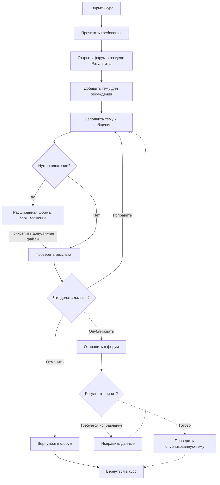

# Задание 3. Анализ работы модуля и последовательность операций

**Клементьев Алексей Александрович · 2ом_КЭО/25**  
«Управление IT-проектами для корпоративного обучения» · РГПУ им. А. И. Герцена  
Дата: **05.10.2026** · [К оглавлению](../README.md)

> **Учебная демонстрация.** Анализ объединяет наблюдение интерфейса Moodle и описание полного пользовательского процесса подготовки и сдачи результата через форум.

## 1. Цель и границы анализа

Цель — описать работу модуля сдачи самостоятельной работы в Moodle как последовательность операций, показать основные развилки и точки возможных затруднений.

Объект — форум «Для загрузки результатов самостоятельной работы 2026-2027 уч.г» внутри курса «Управление IT-проектами для корпоративного обучения».

Анализ охватывает путь от поиска форума и подготовки темы до работы с вложениями, отправки результата, проверки публикации и возврата к курсу.

## 2. Назначение, роли и данные

Модуль предоставляет студенту место для передачи преподавателю результатов самостоятельной работы в виде темы форума. Результат может содержать текст, ссылки на материалы и файловые вложения.

| Элемент | Описание |
|---|---|
| Основной пользователь | Студент, имеющий доступ к курсу |
| Получатель результата | Преподаватель |
| Предусловия | Вход в Moodle, доступ к курсу, подготовленный отчёт или ссылка на него |
| Вход | Название темы, сообщение со сведениями о работе, ссылка и при необходимости файлы |
| Промежуточный результат | Заполненная форма темы |
| Выход | Опубликованная тема со ссылкой и/или вложениями |
| Контроль результата | Проверка содержания темы и доступности материалов |

README и остальные материалы проекта размещаются в GitHub. В Moodle передаётся ссылка на репозиторий или отдельный отчёт в соответствии с форматом сдачи работы.

## 3. Последовательность работы

### 3.1. Переход из курса

Форум находится в разделе «Результаты» рядом с ресурсом «Самостоятельная работа» и примерами отчётов.


*Рисунок 1. Раздел курса с модулем сдачи результатов.*

После открытия форума используется действие «Добавить тему для обсуждения». В быстрой форме доступны название темы, сообщение и основные действия с формой.


*Рисунок 2. Подготовка темы и сообщения для сдачи результата.*

### 3.2. Расширенная форма

Через «Расширенная форма ответа» открывается полная форма с сохранёнными названием и сообщением. В ней доступен блок «Вложение» с областью загрузки файлов.


*Рисунок 3. Расширенная форма: до 9 вложений, размер одного файла до 500 Кбайт.*

Дополнительно форма содержит настройки подписки на тему и теги. Для основного сценария сдачи используются название, сообщение, ссылка на результат и при необходимости вложения.

### 3.3. Возврат к курсу

После работы с формой пользователь возвращается в форум и далее на страницу курса через навигационную ссылку.


*Рисунок 4. Страница форума после возврата из формы.*

## 4. Схема процесса

Схема показывает полный пользовательский путь: поиск места сдачи, подготовку темы, работу с вложениями, проверку результата, публикацию и возврат к курсу.

Сплошные связи обозначают основной путь подготовки и навигации. Пунктиром выделена ветвь публикации и последующей проверки результата.



### PNG-версия


*Рисунок 5. Схема процесса: подготовка и навигация, публикация результата, возврат к курсу.*

Исходник: [Mermaid](diagrams/submission-flow.mmd). Векторная версия: [SVG](diagrams/submission-flow.svg).

## 5. Операции и состояния

| Шаг | Операция | Вход → выход | Основание |
|---|---|---|---|
| 1 | Открыть курс и прочитать указания | Доступ к курсу → контекст задания и способ сдачи | Страница курса и первый отчёт |
| 2 | Найти раздел «Результаты» и форум | Страница курса → страница форума | Интерфейс курса, рис. 1 |
| 3 | Выбрать создание темы | Форум → быстрая форма | Интерфейс форума, рис. 2 |
| 4 | Заполнить название и сообщение | Подготовленный текст → черновик | Форма темы, рис. 2 |
| 5 | При необходимости открыть расширенную форму | Черновик → форма с дополнительными параметрами | Расширенная форма, рис. 3 |
| 6 | Прикрепить файлы | Файлы → подготовленные вложения | Блок «Вложение», рис. 3 |
| 7 | Проверить готовность результата | Черновик → решение об исправлении, публикации или возврате | Логика пользовательского процесса |
| 8а | Вернуться в форум и курс | Черновик → форум → курс | Навигация Moodle, рис. 4 |
| 8б | Отправить тему | Готовая форма → публикация | Действие отправки формы |
| 9 | Обработать результат отправки | Отправленная форма → опубликованная тема или возврат к редактированию | Логика формы и публикации |
| 10 | Проверить опубликованную тему | Тема → подтверждение содержания и доступности материалов | Контроль результата пользователем |

Такая последовательность позволяет рассматривать сдачу как единый процесс с тремя основными этапами: **подготовка → публикация → контроль результата**.

## 6. Правила подготовки результата

| Проверка перед отправкой | Основание |
|---|---|
| Название и сообщение заполнены | Обязательные поля формы |
| По названию можно определить автора и задание | Единый шаблон оформления |
| Ссылка ведёт на нужный README и доступна преподавателю | Проверка доступности результата |
| Размер одного файла составляет до 500 Кбайт, количество — до 9 | Параметры формы форума |
| Текст темы содержит итоговую информацию о работе | Контроль содержания перед публикацией |

Пример рекомендуемого названия:

```text
Юзабилити-тестирование, задания 1–3 — Клементьев А. А., 2ом_КЭО/25
```

В сообщении целесообразно указать ссылку на корневой README, три прямые ссылки на отчёты и краткий перечень приложений.

Для подготовленного комплекта ссылка на GitHub упрощает передачу связанных материалов и сохраняет структуру проекта. Файловые вложения могут использоваться для отдельных документов в пределах ограничений формы.

## 7. Точки затруднений и улучшения

| Точка | Причина | Улучшение | Ожидаемый эффект |
|---|---|---|---|
| Требования | Информация о составе результата распределена по материалам курса | Разместить полный текст задания и критерии результата | Быстрее определить состав работы |
| Вход в сдачу | Название форума и действие «Добавить тему для обсуждения» используют разную терминологию | Добавить инструкцию рядом с созданием темы | Понятнее следующий шаг |
| Подготовка файлов | Вложения находятся в расширенной форме | Добавить подпись о прикреплении файлов и заранее показать ограничения | Быстрее находить загрузку файлов |
| Оформление темы | В пустом форуме отсутствует готовый образец оформления | Добавить шаблон названия и сообщения | Единообразное оформление результатов |
| Контроль результата | Перед публикацией требуется проверить несколько элементов | Добавить краткий чек-лист перед отправкой | Меньше ошибок в содержании темы |

Основной резерв улучшения связан с ясностью переходов между этапами. Пользователь должен быстро понимать, где находится место сдачи, как оформить тему, как добавить файлы и что проверить перед отправкой.

## 8. Источники

1. [Курс Moodle](https://moodle.herzen.spb.ru/course/view.php?id=26648).
2. [Форум результатов](https://moodle.herzen.spb.ru/mod/forum/view.php?id=1353655).
3. [Moodle Docs: Forum posting](https://docs.moodle.org/404/en/Forum_posting) — общая логика создания и публикации сообщений.
4. [Протокол и происхождение изображений](../evidence/README.md).
5. [Отчёт юзабилити](../01-usability/README.md) и [отчёт SUS](../02-sus/README.md).

## 9. Выводы

Сдача самостоятельной работы в Moodle строится вокруг создания темы форума. Пользователь переходит из курса в раздел «Результаты», создаёт тему, заполняет название и сообщение, при необходимости добавляет вложения, проверяет содержание и публикует результат.

Анализ выделяет три основных этапа процесса: **подготовка результата, публикация и контроль**. Ключевые развилки связаны с добавлением вложений, исправлением содержимого и выбором дальнейшего действия после подготовки формы.

Основные улучшения относятся к объяснению пользовательского пути: размещению полного текста задания, явной связи создания темы со сдачей результата, инструкции по вложениям и шаблону оформления темы. Эти изменения сокращают число лишних действий и делают процесс сдачи более последовательным.
