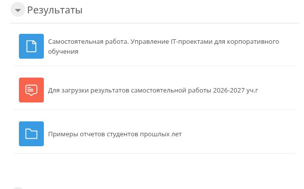
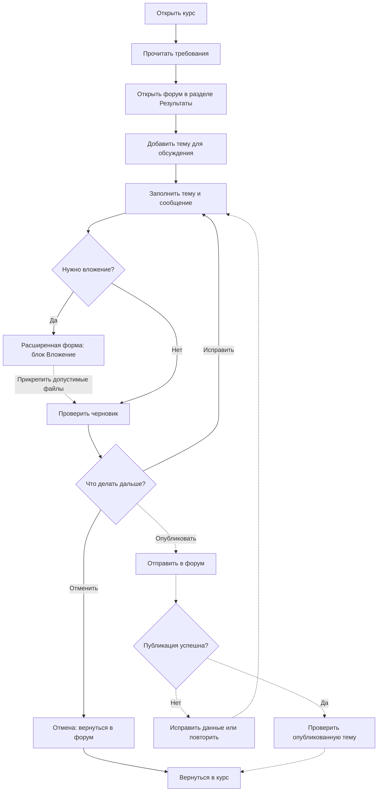
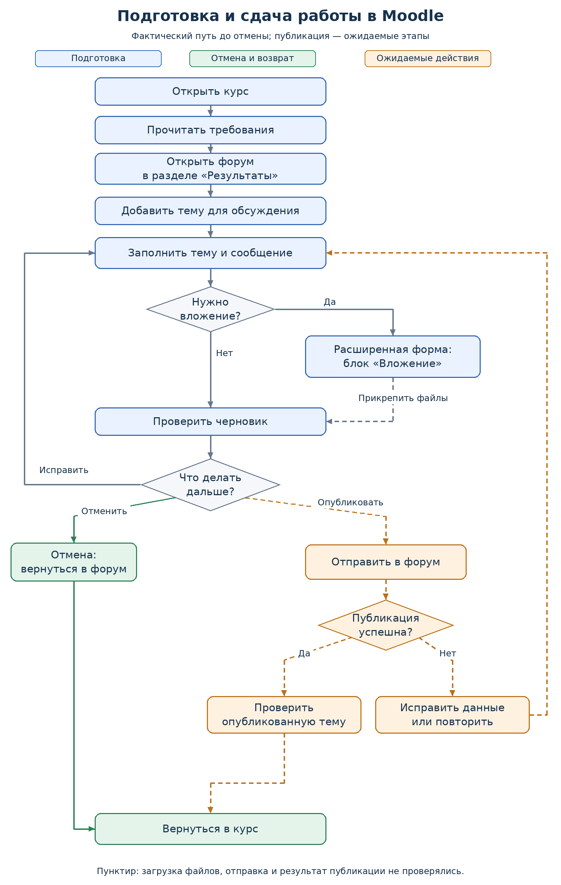

# Задание 3. Анализ работы модуля и последовательность операций

**Клементьев Алексей Александрович · 2ом_КЭО/25**  
«Управление IT-проектами для корпоративного обучения» · РГПУ им. А. И. Герцена  
Дата: **05.10.2026** · [К оглавлению](../README.md)

## 1. Цель и границы анализа

Цель — описать работу модуля сдачи самостоятельной работы в Moodle как последовательность операций, показать развилки и точки возможных затруднений.

Объект — форум «Для загрузки результатов самостоятельной работы 2026-2027 уч.г» внутри курса «Управление IT-проектами для корпоративного обучения».

**Фактически проверено:** поиск форума, открытие темы, заполнение учебного текста, переход в расширенную форму, наличие и параметры блока вложений, отмена, возврат к курсу.  
**Ожидаемые этапы:** прикрепление файлов, отправка, серверная проверка, появление и контроль опубликованной темы. Они описаны как логика процесса и по документации Moodle, но не выполнялись. Внутренние запросы, база данных и механизм оценивания не исследовались.

## 2. Назначение, роли и данные

Модуль предоставляет студенту место для передачи преподавателю результатов самостоятельной работы в виде темы форума. В общем описании курса указан способ передачи ссылки на материалы; у форума также доступен механизм файловых вложений.

| Элемент | Описание |
|---|---|
| Основной пользователь | Студент, имеющий доступ к курсу |
| Получатель результата | Преподаватель, читающий тему; получение и оценивание в этой проверке не наблюдались |
| Предусловия | Вход в Moodle, доступ к курсу, подготовленный отчёт или ссылка на него |
| Вход | Название темы, сообщение со сведениями о работе и ссылкой; при необходимости — файлы |
| Промежуточный результат | Заполненная форма, ещё не опубликованная в форуме |
| Ожидаемый выход | Тема со ссылкой/вложениями, доступная участникам согласно настройкам форума |
| Фактический выход проверки | Учебный черновик отменён, новых тем нет |

Сам форум не является редактором Markdown-репозитория. README размещаются в GitHub, а в Moodle может передаваться ссылка на репозиторий или отдельный отчёт — в соответствии с актуальными указаниями преподавателя.

## 3. Наблюдаемая последовательность

### 3.1. Переход из курса

Форум находится в разделе «Результаты» рядом с ресурсом «Самостоятельная работа» и примерами отчётов.



*Рисунок 1. Настоящий скриншот входа в модуль сдачи.*

После открытия форума используется «Добавить тему для обсуждения». В быстрой форме доступны название и сообщение, а также кнопки отправки, отмены и расширенного режима.


*Рисунок 2. Подготовлен демонстрационный черновик; отправки не было.*

### 3.2. Расширенная форма

При переходе через «Расширенная форма ответа» учебное название и сообщение сохранились. Появился блок «Вложение» с областью загрузки файлов.


*Рисунок 3. Фактически видимые поля и ограничения: не более 9 вложений, размер нового файла до 500 Кбайт. Параметры зафиксированы на 05.10.2026 и зависят от настроек этого форума.*

На скриншоте также есть настройка подписки на тему и теги. Они не являются обязательными входами рассматриваемого сценария. Настройка подписки не менялась, файлы не прикреплялись.

### 3.3. Завершение проверки

Нажата «Отмена» в расширенной форме. Проверено возвращение в форум, затем переход на страницу курса через навигационную ссылку и повторное открытие форума. Отображалось «Нет тем для обсуждения».


*Рисунок 4. Подтверждение отсутствия публикации.*

## 4. Схема процесса

Сплошные связи показывают путь подготовки и отмены, опирающийся на фактический интерфейс. Решения в ромбах — логические развилки пользователя. Пунктирные связи обозначают непроверенные действия с файлами, публикацию и обработку результата. Рисунок не утверждает, что серверные ветви были выполнены.



### PNG-версия



*Рисунок 5. Та же логика в статическом формате. Синие блоки — подготовка и навигация, оранжевые — ожидаемая публикация, зелёные — отмена и возврат.*

Исходник: [Mermaid](diagrams/submission-flow.mmd). Векторная версия: [SVG](diagrams/submission-flow.svg).

## 5. Операции и состояния

| Шаг | Операция | Вход → выход | Статус и подтверждение |
|---|---|---|---|
| 1 | Открыть курс и прочитать указания | Доступ к курсу → контекст задания и способ сдачи | Проверено; первый отчёт, рис. 1–2 |
| 2 | Найти раздел «Результаты» и форум | Страница курса → страница форума | Проверено; рис. 1 |
| 3 | Выбрать создание темы | Форум → быстрая форма | Проверено; рис. 2 |
| 4 | Заполнить название и сообщение | Учебный текст → черновик | Проверено; рис. 2 |
| 5 | При необходимости открыть расширенную форму | Черновик → расширенная форма с сохранённым текстом | Проверено; рис. 3 |
| 6 | Прикрепить файлы в допустимых пределах | Файлы → подготовленные вложения | Только ожидаемая операция; блок и пределы наблюдались, загрузка не выполнялась |
| 7 | Проверить готовность | Черновик → решение об исправлении, отмене или отправке | Проверка учебного текста выполнена; развилки формализованы аналитически |
| 8а | Отменить и вернуться в курс | Черновик → форум без новой темы → курс | Проверено; рис. 4 и протокол |
| 8б | Отправить в форум | Готовая форма → запрос публикации | Не выполнялось |
| 9 | Получить успешный результат или ошибку | Запрос → опубликованная тема либо необходимость исправления/повтора | Ожидаемая логика; серверные ответы не наблюдались |
| 10 | Проверить опубликованную тему | Тема → подтверждение содержания и доступности ссылок | Ожидаемое действие студента; в этой проверке темы нет |

Для шага 9 не заявляются конкретные сообщения об ошибках, сроки уведомлений или обязательные ограничения сверх тех, что показаны в форме.

## 6. Правила подготовки результата

| Проверка перед отправкой | Основание |
|---|---|
| Название и сообщение заполнены | Оба поля помечены как обязательные в форме |
| По названию можно определить автора и задание | Рекомендуемый шаблон; интерфейс такой формат автоматически не проверял |
| Ссылка ведёт на нужный README и доступна преподавателю | Необходимое условие пригодности результата, проверяется пользователем |
| Каждый прикрепляемый файл не превышает 500 Кбайт, число файлов не превышает 9 | Видимые ограничения данного форума |
| Не используется случайный черновик или служебный текст | Контроль содержания перед необратимым для аудитории действием публикации |

Пример рекомендуемого названия:

```text
Юзабилити-тестирование, задания 1–3 — Клементьев А. А., 2ом_КЭО/25
```

В сообщении целесообразно указать ссылку на корневой README, три прямые ссылки на отчёты и краткий перечень приложений. Для подготовленного комплекта ссылка на GitHub удобнее загрузки полного архива: ограничение 500 Кбайт относится к каждому вложению, а не к внешней ссылке. Публикация конкретной ссылки в Moodle в эту работу не входила.

## 7. Точки затруднений и улучшения

| Точка | Причина, наблюдаемая в интерфейсе | Улучшение | Ожидаемый эффект, который нужно проверить |
|---|---|---|---|
| Требования | Ресурс задания не содержит три задачи | Полный текст задания, критерии результата | Меньше обращений за уточнением |
| Вход в сдачу | Название форума говорит о загрузке, кнопка — об обсуждении | Инструкция рядом с кнопкой создания темы | Понятнее следующий шаг |
| Подготовка файлов | Блок вложений появляется в расширенном режиме | Подпись «Для прикрепления файлов», ограничения заранее | Меньше поисковых действий |
| Оформление темы | Нет видимого образца в пустом форуме | Шаблон названия и сообщения | Проще идентифицировать автора и отчёт |
| Контроль результата | Публикация — отдельный шаг после подготовки | Проверка ссылки и состава результата перед отправкой | Меньше неполных тем |

Последний эффект предложен на основании логики процесса; ошибки опубликованных работ в этой проверке не анализировались.

## 8. Источники

1. [Курс Moodle](https://moodle.herzen.spb.ru/course/view.php?id=26648).
2. [Форум результатов](https://moodle.herzen.spb.ru/mod/forum/view.php?id=1353655).
3. [Moodle Docs: Forum posting](https://docs.moodle.org/404/en/Forum_posting) — общая логика создания сообщений; документация не подтверждает настройки конкретного курса.
4. [Протокол и происхождение изображений](../evidence/README.md).
5. [Отчёт юзабилити](../01-usability/README.md) и [отчёт SUS](../02-sus/README.md).

## 9. Выводы

Модуль реализует подготовку сдачи через создание темы форума. Фактически подтверждены переход от курса к форме, заполнение текста, расширенный режим с вложениями и отмена без публикации. Составлена схема с решениями об исправлении, отмене и отправке.

Основные улучшения относятся к объяснению процесса: полный текст задания, понятная связь создания темы со сдачей и инструкция по вложениям. Публикация и обработка серверных ошибок остаются этапами для отдельной проверки на разрешённой тестовой площадке.
